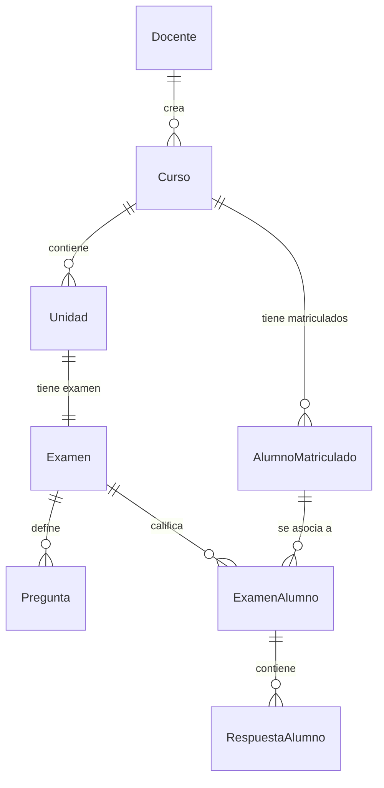

# Diseño y Script de Base de Datos - SCIBM

Este documento presenta el diseño relacional y el script DDL en **SQL Server** para soportar el sistema SCIBM de manera normalizada, garantizando la integridad de datos, eliminando la redundancia y optimizando las consultas del sistema.

---

## Estructura Relacional (Normalizada)

El diseño sigue las reglas de la **Tercera Forma Normal (3NF)**:
1. **Docente:** Almacena la cuenta de Google, tokens y carpeta raíz.
2. **Curso:** Pertenece a un Docente.
3. **AlumnoMatriculado:** Lista de alumnos cargados por Excel vinculados a un curso. Evita duplicación mediante restricción única.
4. **Unidad:** Unidades dinámicas creadas para cada curso.
5. **Examen:** Plantilla de examen asociada a una Unidad (relación 1-a-1: un examen por unidad).
6. **Pregunta:** Lista de preguntas por plantilla con coordenadas y puntajes individuales.
7. **ExamenAlumno:** Registro de exámenes cargados y calificados de los estudiantes, vinculado al alumno matriculado (permite nulo si está observado).
8. **RespuestaAlumno:** Respuestas individuales de cada estudiante para cada pregunta.



---

## SQL Server DDL Script

A continuación, se presenta el script SQL completo para crear las tablas, llaves primarias, llaves foráneas, restricciones de unicidad e índices para optimizar la búsqueda.

```sql
-- 1. Tabla de Docentes (Usuarios del sistema)
CREATE TABLE Docente (
    Email NVARCHAR(150) NOT NULL,
    Nombre NVARCHAR(100) NOT NULL,
    Apellido NVARCHAR(100) NOT NULL,
    GoogleDriveFolderId NVARCHAR(100) NULL,
    RefreshToken NVARCHAR(250) NULL,
    UltimoAcceso DATETIME NOT NULL DEFAULT GETDATE(),
    CONSTRAINT PK_Docente PRIMARY KEY (Email)
);

-- 2. Tabla de Cursos
CREATE TABLE Curso (
    Id UNIQUEIDENTIFIER NOT NULL DEFAULT NEWID(),
    Nombre NVARCHAR(150) NOT NULL,
    Codigo NVARCHAR(50) NOT NULL,
    DocenteEmail NVARCHAR(150) NOT NULL,
    DriveFolderId NVARCHAR(100) NULL,
    CONSTRAINT PK_Curso PRIMARY KEY (Id),
    CONSTRAINT FK_Curso_Docente FOREIGN KEY (DocenteEmail) 
        REFERENCES Docente(Email) ON DELETE CASCADE
);

-- 3. Tabla de Alumnos Matriculados (Cargados por Excel)
CREATE TABLE AlumnoMatriculado (
    Id UNIQUEIDENTIFIER NOT NULL DEFAULT NEWID(),
    CursoId UNIQUEIDENTIFIER NOT NULL,
    NombreCompleto NVARCHAR(250) NOT NULL,
    Apellidos NVARCHAR(120) NOT NULL,
    Nombres NVARCHAR(120) NOT NULL,
    CONSTRAINT PK_AlumnoMatriculado PRIMARY KEY (Id),
    CONSTRAINT FK_AlumnoMatriculado_Curso FOREIGN KEY (CursoId) 
        REFERENCES Curso(Id) ON DELETE CASCADE,
    -- Evitar duplicar el mismo alumno en el mismo curso
    CONSTRAINT UQ_Curso_Alumno UNIQUE (CursoId, NombreCompleto)
);

-- 4. Tabla de Unidades (Dinámicas)
CREATE TABLE Unidad (
    Id UNIQUEIDENTIFIER NOT NULL DEFAULT NEWID(),
    CursoId UNIQUEIDENTIFIER NOT NULL,
    NombreUnidad NVARCHAR(50) NOT NULL, -- Ej: 'U1', 'U1R', 'U2'
    DriveFolderId NVARCHAR(100) NULL,
    CONSTRAINT PK_Unidad PRIMARY KEY (Id),
    CONSTRAINT FK_Unidad_Curso FOREIGN KEY (CursoId) 
        REFERENCES Curso(Id) ON DELETE CASCADE,
    -- Evitar duplicar el nombre de la unidad dentro de un mismo curso
    CONSTRAINT UQ_Curso_Unidad UNIQUE (CursoId, NombreUnidad)
);

-- 5. Tabla de Exámenes (Plantillas)
CREATE TABLE Examen (
    Id UNIQUEIDENTIFIER NOT NULL DEFAULT NEWID(),
    UnidadId UNIQUEIDENTIFIER NOT NULL,
    Titulo NVARCHAR(150) NOT NULL,
    RutaPdfOriginal NVARCHAR(250) NOT NULL, -- Ruta física en el servidor
    DriveFileIdBlanco NVARCHAR(100) NULL,
    DriveFileIdSolucionario NVARCHAR(100) NULL,
    SincronizadoDrive BIT NOT NULL DEFAULT 0,
    -- Coordenadas de calibración para la caja de estampado de nota
    StampX FLOAT NOT NULL DEFAULT 450,
    StampY FLOAT NOT NULL DEFAULT 50,
    StampWidth FLOAT NOT NULL DEFAULT 100,
    StampHeight FLOAT NOT NULL DEFAULT 40,
    CONSTRAINT PK_Examen PRIMARY KEY (Id),
    CONSTRAINT FK_Examen_Unidad FOREIGN KEY (UnidadId) 
        REFERENCES Unidad(Id) ON DELETE CASCADE,
    -- Relación de 1 examen por unidad
    CONSTRAINT UQ_Unidad_Examen UNIQUE (UnidadId)
);

-- 6. Tabla de Preguntas (Definidas en la plantilla del examen)
CREATE TABLE Pregunta (
    Id UNIQUEIDENTIFIER NOT NULL DEFAULT NEWID(),
    ExamenId UNIQUEIDENTIFIER NOT NULL,
    NumeroPregunta INT NOT NULL,
    Enunciado NVARCHAR(MAX) NOT NULL,
    Tipo NVARCHAR(30) NOT NULL, -- 'OpcionMultiple' o 'RespuestaLibre'
    RespuestaCorrecta NVARCHAR(150) NOT NULL, -- Ej: 'A', 'B', o texto
    Puntaje FLOAT NOT NULL, -- Puntaje/peso de la pregunta extraído por OCR
    -- Coordenadas de la pregunta en la página del PDF
    PosX FLOAT NOT NULL,
    PosY FLOAT NOT NULL,
    Width FLOAT NOT NULL,
    Height FLOAT NOT NULL,
    OpcionesJson NVARCHAR(MAX) NULL, -- Guarda coordenadas de sub-opciones (A, B, C, D, E) en formato JSON
    CONSTRAINT PK_Pregunta PRIMARY KEY (Id),
    CONSTRAINT FK_Pregunta_Examen FOREIGN KEY (ExamenId) 
        REFERENCES Examen(Id) ON DELETE CASCADE,
    -- Evitar repetir el número de pregunta en el mismo examen
    CONSTRAINT UQ_Examen_NumeroPregunta UNIQUE (ExamenId, NumeroPregunta)
);

-- 7. Tabla de Exámenes de Alumnos (Calificaciones de hojas escaneadas)
CREATE TABLE ExamenAlumno (
    Id UNIQUEIDENTIFIER NOT NULL DEFAULT NEWID(),
    ExamenId UNIQUEIDENTIFIER NOT NULL,
    NombreAlumno NVARCHAR(250) NOT NULL, -- Nombre en bruto extraído por OCR
    AlumnoMatriculadoId UNIQUEIDENTIFIER NULL, -- FK de asociación (Nulo si está observado)
    Nota FLOAT NOT NULL, -- Suma de puntajes de respuestas correctas
    RutaPdfRespuesta NVARCHAR(250) NOT NULL, -- Archivo local del alumno
    DriveFileId NVARCHAR(100) NULL,
    SincronizadoDrive BIT NOT NULL DEFAULT 0,
    TieneObservacion BIT NOT NULL DEFAULT 0,
    Observacion NVARCHAR(250) NULL, -- Razón de error si TieneObservacion es 1
    FechaCalificacion DATETIME NOT NULL DEFAULT GETDATE(),
    CONSTRAINT PK_ExamenAlumno PRIMARY KEY (Id),
    CONSTRAINT FK_ExamenAlumno_Examen FOREIGN KEY (ExamenId) 
        REFERENCES Examen(Id) ON DELETE CASCADE,
    CONSTRAINT FK_ExamenAlumno_Matricula FOREIGN KEY (AlumnoMatriculadoId) 
        REFERENCES AlumnoMatriculado(Id) ON DELETE NO ACTION
);

-- 8. Tabla de Respuestas dadas por los Alumnos
CREATE TABLE RespuestaAlumno (
    Id UNIQUEIDENTIFIER NOT NULL DEFAULT NEWID(),
    ExamenAlumnoId UNIQUEIDENTIFIER NOT NULL,
    NumeroPregunta INT NOT NULL,
    RespuestaDada NVARCHAR(150) NOT NULL, -- Lo que marcó o escribió
    EsCorrecta BIT NOT NULL, -- Comparación automática
    CONSTRAINT PK_RespuestaAlumno PRIMARY KEY (Id),
    CONSTRAINT FK_RespuestaAlumno_ExamenAlumno FOREIGN KEY (ExamenAlumnoId) 
        REFERENCES ExamenAlumno(Id) ON DELETE CASCADE,
    -- Evita registrar dos respuestas para la misma pregunta de un alumno
    CONSTRAINT UQ_ExamenAlumno_NumeroPregunta UNIQUE (ExamenAlumnoId, NumeroPregunta)
);

-- 9. Índices para optimizar velocidad de reportes y consultas
CREATE INDEX IX_Curso_DocenteEmail ON Curso(DocenteEmail);
CREATE INDEX IX_AlumnoMatriculado_CursoId ON AlumnoMatriculado(CursoId);
CREATE INDEX IX_Unidad_CursoId ON Unidad(CursoId);
CREATE INDEX IX_Pregunta_ExamenId ON Pregunta(ExamenId);
CREATE INDEX IX_ExamenAlumno_ExamenId ON ExamenAlumno(ExamenId);
CREATE INDEX IX_ExamenAlumno_Matricula ON ExamenAlumno(AlumnoMatriculadoId);
CREATE INDEX IX_RespuestaAlumno_ExamenAlumnoId ON RespuestaAlumno(ExamenAlumnoId);
```

---

## Análisis de No Redundancia (Normalización)

- **Emails como Llave Primaria en Docente:** Se aprovecha que el correo es único a nivel institucional para usarlo como llave e indexar directamente, reduciendo un JOIN con un ID artificial para las consultas de cursos creados.
- **Relaciones Desacopladas:** La información física del alumno matriculado (Nombres, Apellidos, Curso al que pertenece) se guarda en la tabla `AlumnoMatriculado`. El registro de calificación (`ExamenAlumno`) solo almacena el ID del alumno matriculado (`AlumnoMatriculadoId`). No duplicamos el nombre normalizado del alumno en cada examen rendido.
- **Separación de Preguntas y Respuestas:** El texto de la pregunta, puntajes y coordenadas se guardan una sola vez en `Pregunta`. El alumno solo almacena su respuesta (`RespuestaDada`) y si fue correcta (`EsCorrecta`) referenciando al número de la pregunta. Esto ahorra gigabytes de almacenamiento de texto redundante en bases de datos con miles de exámenes.
- **Restricciones de Unicidad (`UNIQUE`):** 
  - `UQ_Curso_Alumno` evita registrar al mismo alumno dos veces en un mismo curso.
  - `UQ_Curso_Unidad` garantiza que el docente no cree dos unidades con el mismo nombre (ej: no dos `U1` en el mismo curso).
  - `UQ_Examen_NumeroPregunta` e `UQ_ExamenAlumno_NumeroPregunta` protegen contra la inserción de datos duplicados por errores del bucle de parseo en el backend.
- **Índices Estratégicos:** Se añadieron índices en las llaves foráneas comunes para acelerar la generación de reportes generales (consolidado de notas) y detallados (por pregunta), minimizando la carga de CPU de SQL Server en consultas complejas.
