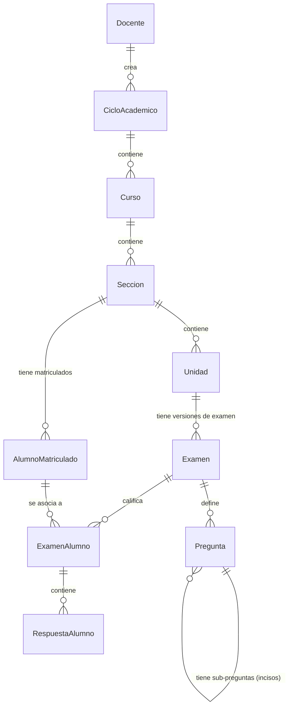

# Diseño y Script de Base de Datos - SCIBM

Este documento presenta el diseño relacional y el script DDL en **SQL Server** para soportar el sistema SCIBM de manera normalizada, garantizando la integridad de datos, eliminando la redundancia y optimizando las consultas del sistema.

---

## Estructura Relacional (Normalizada)

El diseño sigue las reglas de la **Tercera Forma Normal (3NF)**:
1. **Docente:** Almacena la cuenta de Google, tokens y carpeta raíz.
2. **Ciclo Académico:** Agrupación temporal (ej: "2024-I") que pertenece a un Docente.
3. **Curso:** Pertenece a un Ciclo Académico.
4. **Sección:** División de un curso (ej: "Sección A").
5. **AlumnoMatriculado:** Lista de alumnos cargados por Excel vinculados a una sección. Evita duplicación mediante restricción única.
6. **Unidad:** Unidades dinámicas creadas para cada sección.
7. **Examen:** Plantilla de examen asociada a una Unidad. Soporta versiones múltiples (ej: "Fila A", "Fila B").
8. **Pregunta:** Lista de preguntas por plantilla con coordenadas y puntajes individuales. Soporta recursividad (PreguntaPadre e Incisos).
9. **ExamenAlumno:** Registro de exámenes cargados y calificados de los estudiantes, vinculado al alumno matriculado (permite nulo si está observado).
10. **RespuestaAlumno:** Respuestas individuales de cada estudiante para cada pregunta e inciso.



---

## SQL Server DDL Script

A continuación, se presenta el script SQL completo para crear las tablas, llaves primarias, llaves foráneas, restricciones de unicidad e índices para optimizar la búsqueda.

```sql
-- 1. Crear Tabla Docente (La raíz del sistema)
CREATE TABLE Docente (
    Email NVARCHAR(150) NOT NULL,
    Nombre NVARCHAR(100) NOT NULL,
    Apellido NVARCHAR(100) NOT NULL,
    GoogleDriveFolderId NVARCHAR(100) NULL,
    RefreshToken NVARCHAR(250) NULL,
    UltimoAcceso DATETIME NOT NULL DEFAULT GETDATE(),
    CONSTRAINT PK_Docente PRIMARY KEY (Email)
);

-- 2. Crear Tabla CicloAcademico
CREATE TABLE CicloAcademico (
    Id UNIQUEIDENTIFIER NOT NULL DEFAULT NEWID(),
    Nombre NVARCHAR(50) NOT NULL,
    DocenteEmail NVARCHAR(150) NOT NULL,
    DriveFolderId NVARCHAR(100) NULL,
    CONSTRAINT PK_CicloAcademico PRIMARY KEY (Id),
    CONSTRAINT FK_CicloAcademico_Docente FOREIGN KEY (DocenteEmail) REFERENCES Docente(Email) ON DELETE CASCADE
);

-- 3. Crear Tabla Curso
CREATE TABLE Curso (
    Id UNIQUEIDENTIFIER NOT NULL DEFAULT NEWID(),
    Nombre NVARCHAR(150) NOT NULL,
    Codigo NVARCHAR(50) NOT NULL,
    CicloAcademicoId UNIQUEIDENTIFIER NOT NULL,
    DriveFolderId NVARCHAR(100) NULL,
    CONSTRAINT PK_Curso PRIMARY KEY (Id),
    CONSTRAINT FK_Curso_CicloAcademico FOREIGN KEY (CicloAcademicoId) REFERENCES CicloAcademico(Id) ON DELETE CASCADE
);

-- 4. Crear Tabla Seccion
CREATE TABLE Seccion (
    Id UNIQUEIDENTIFIER NOT NULL DEFAULT NEWID(),
    CursoId UNIQUEIDENTIFIER NOT NULL,
    Nombre NVARCHAR(100) NOT NULL,
    DriveFolderId NVARCHAR(100) NULL,
    CONSTRAINT PK_Seccion PRIMARY KEY (Id),
    CONSTRAINT FK_Seccion_Curso FOREIGN KEY (CursoId) REFERENCES Curso(Id) ON DELETE CASCADE
);

-- 5. Crear Tabla AlumnoMatriculado
CREATE TABLE AlumnoMatriculado (
    Id UNIQUEIDENTIFIER NOT NULL DEFAULT NEWID(),
    SeccionId UNIQUEIDENTIFIER NOT NULL,
    NombreCompleto NVARCHAR(250) NOT NULL,
    Apellidos NVARCHAR(120) NOT NULL,
    Nombres NVARCHAR(120) NOT NULL,
    CONSTRAINT PK_AlumnoMatriculado PRIMARY KEY (Id),
    CONSTRAINT FK_AlumnoMatriculado_Seccion FOREIGN KEY (SeccionId) REFERENCES Seccion(Id) ON DELETE CASCADE,
    CONSTRAINT UQ_Seccion_Alumno UNIQUE (SeccionId, NombreCompleto)
);

-- 6. Crear Tabla Unidad
CREATE TABLE Unidad (
    Id UNIQUEIDENTIFIER NOT NULL DEFAULT NEWID(),
    SeccionId UNIQUEIDENTIFIER NOT NULL,
    NombreUnidad NVARCHAR(50) NOT NULL, 
    DriveFolderId NVARCHAR(100) NULL,
    CONSTRAINT PK_Unidad PRIMARY KEY (Id),
    CONSTRAINT FK_Unidad_Seccion FOREIGN KEY (SeccionId) REFERENCES Seccion(Id) ON DELETE CASCADE,
    CONSTRAINT UQ_Seccion_Unidad UNIQUE (SeccionId, NombreUnidad)
);

-- 7. Crear Tabla Examen (Versiones Múltiples)
CREATE TABLE Examen (
    Id UNIQUEIDENTIFIER NOT NULL DEFAULT NEWID(),
    UnidadId UNIQUEIDENTIFIER NOT NULL,
    NombreVersion NVARCHAR(100) NOT NULL,
    DriveFolderId NVARCHAR(100) NULL,
    RutaPdfOriginal NVARCHAR(250) NOT NULL,
    DriveFileIdBlanco NVARCHAR(100) NULL,
    DriveFileIdSolucionario NVARCHAR(100) NULL,
    SincronizadoDrive BIT NOT NULL DEFAULT 0,
    StampX FLOAT NOT NULL DEFAULT 450,
    StampY FLOAT NOT NULL DEFAULT 50,
    StampWidth FLOAT NOT NULL DEFAULT 100,
    StampHeight FLOAT NOT NULL DEFAULT 40,
    CONSTRAINT PK_Examen PRIMARY KEY (Id),
    CONSTRAINT FK_Examen_Unidad FOREIGN KEY (UnidadId) REFERENCES Unidad(Id) ON DELETE CASCADE,
    CONSTRAINT UQ_Unidad_Version UNIQUE (UnidadId, NombreVersion)
);

-- 8. Crear Tabla Pregunta (Soporte para Sub-preguntas / Incisos)
CREATE TABLE Pregunta (
    Id UNIQUEIDENTIFIER NOT NULL DEFAULT NEWID(),
    ExamenId UNIQUEIDENTIFIER NOT NULL,
    PreguntaPadreId UNIQUEIDENTIFIER NULL,
    Inciso NVARCHAR(10) NULL,
    NumeroPregunta INT NOT NULL,
    Pagina INT NOT NULL DEFAULT 1,
    Enunciado NVARCHAR(MAX) NOT NULL,
    Tipo NVARCHAR(30) NOT NULL,
    RespuestaCorrecta NVARCHAR(150) NOT NULL,
    Puntaje FLOAT NOT NULL,
    PosX FLOAT NOT NULL,
    PosY FLOAT NOT NULL,
    Width FLOAT NOT NULL,
    Height FLOAT NOT NULL,
    OpcionesJson NVARCHAR(MAX) NULL,
    CONSTRAINT PK_Pregunta PRIMARY KEY (Id),
    CONSTRAINT FK_Pregunta_Examen FOREIGN KEY (ExamenId) REFERENCES Examen(Id) ON DELETE CASCADE,
    CONSTRAINT FK_Pregunta_PreguntaPadre FOREIGN KEY (PreguntaPadreId) REFERENCES Pregunta(Id),
    CONSTRAINT UQ_Examen_NumeroPregunta UNIQUE (ExamenId, NumeroPregunta, Inciso)
);

-- 9. Crear Tabla ExamenAlumno
CREATE TABLE ExamenAlumno (
    Id UNIQUEIDENTIFIER NOT NULL DEFAULT NEWID(),
    ExamenId UNIQUEIDENTIFIER NOT NULL,
    NombreAlumno NVARCHAR(250) NOT NULL,
    AlumnoMatriculadoId UNIQUEIDENTIFIER NULL,
    Nota FLOAT NOT NULL,
    RutaPdfRespuesta NVARCHAR(250) NOT NULL,
    DriveFileId NVARCHAR(100) NULL,
    SincronizadoDrive BIT NOT NULL DEFAULT 0,
    TieneObservacion BIT NOT NULL DEFAULT 0,
    Observacion NVARCHAR(250) NULL,
    FechaCalificacion DATETIME NOT NULL DEFAULT GETDATE(),
    CONSTRAINT PK_ExamenAlumno PRIMARY KEY (Id),
    CONSTRAINT FK_ExamenAlumno_Examen FOREIGN KEY (ExamenId) REFERENCES Examen(Id) ON DELETE CASCADE,
    CONSTRAINT FK_ExamenAlumno_Alumno FOREIGN KEY (AlumnoMatriculadoId) REFERENCES AlumnoMatriculado(Id)
);

-- 10. Crear Tabla RespuestaAlumno
CREATE TABLE RespuestaAlumno (
    Id UNIQUEIDENTIFIER NOT NULL DEFAULT NEWID(),
    ExamenAlumnoId UNIQUEIDENTIFIER NOT NULL,
    NumeroPregunta INT NOT NULL,
    Inciso NVARCHAR(10) NULL,
    RespuestaDada NVARCHAR(150) NOT NULL,
    EsCorrecta BIT NOT NULL,
    CONSTRAINT PK_RespuestaAlumno PRIMARY KEY (Id),
    CONSTRAINT FK_RespuestaAlumno_ExamenAlumno FOREIGN KEY (ExamenAlumnoId) REFERENCES ExamenAlumno(Id) ON DELETE CASCADE
);

-- 11. Índices para optimizar velocidad de reportes y consultas
CREATE INDEX IX_CicloAcademico_DocenteEmail ON CicloAcademico(DocenteEmail);
CREATE INDEX IX_Curso_CicloAcademicoId ON Curso(CicloAcademicoId);
CREATE INDEX IX_Seccion_CursoId ON Seccion(CursoId);
CREATE INDEX IX_AlumnoMatriculado_SeccionId ON AlumnoMatriculado(SeccionId);
CREATE INDEX IX_Unidad_SeccionId ON Unidad(SeccionId);
CREATE INDEX IX_Examen_UnidadId ON Examen(UnidadId);
CREATE INDEX IX_Pregunta_ExamenId ON Pregunta(ExamenId);
CREATE INDEX IX_ExamenAlumno_ExamenId ON ExamenAlumno(ExamenId);
CREATE INDEX IX_ExamenAlumno_Matricula ON ExamenAlumno(AlumnoMatriculadoId);
CREATE INDEX IX_RespuestaAlumno_ExamenAlumnoId ON RespuestaAlumno(ExamenAlumnoId);
```

---

## Análisis de No Redundancia (Normalización)

- **Emails como Llave Primaria en Docente:** Se aprovecha que el correo es único a nivel institucional para usarlo como llave e indexar directamente, reduciendo un JOIN con un ID artificial.
- **Relaciones Desacopladas (Nuevos Niveles):** La inclusión de `CicloAcademico` y `Seccion` permite una mejor organización semestral y separación de grupos de alumnos, reflejando el modelo académico real.
- **Sub-preguntas y Exámenes (Versiones):** La tabla `Examen` ahora soporta "NombreVersion" (ej. Fila A y Fila B) asegurando unicidad por Unidad (`UQ_Unidad_Version`). La tabla `Pregunta` ahora soporta `PreguntaPadreId` e `Inciso`, lo cual permite descomponer preguntas complejas (1a, 1b) y guardarlas independientemente para calificar el puntaje fraccionado.
- **Restricciones de Unicidad (`UNIQUE`):** 
  - `UQ_Seccion_Alumno` evita registrar al mismo alumno dos veces en la misma sección.
  - `UQ_Seccion_Unidad` garantiza que el docente no cree dos unidades con el mismo nombre en la misma sección.
  - `UQ_Examen_NumeroPregunta` protege contra inserciones de preguntas duplicadas.
- **Separación de Preguntas y Respuestas:** El texto de la pregunta, puntajes y coordenadas se guardan una sola vez en `Pregunta`. El alumno solo almacena su respuesta y si fue correcta referenciando a la pregunta/inciso, ahorrando gigabytes de texto redundante.
- **Índices Estratégicos:** Se añadieron índices en las llaves foráneas comunes para acelerar la generación de reportes generales (consolidado de notas por sección) y detallados (por pregunta).
